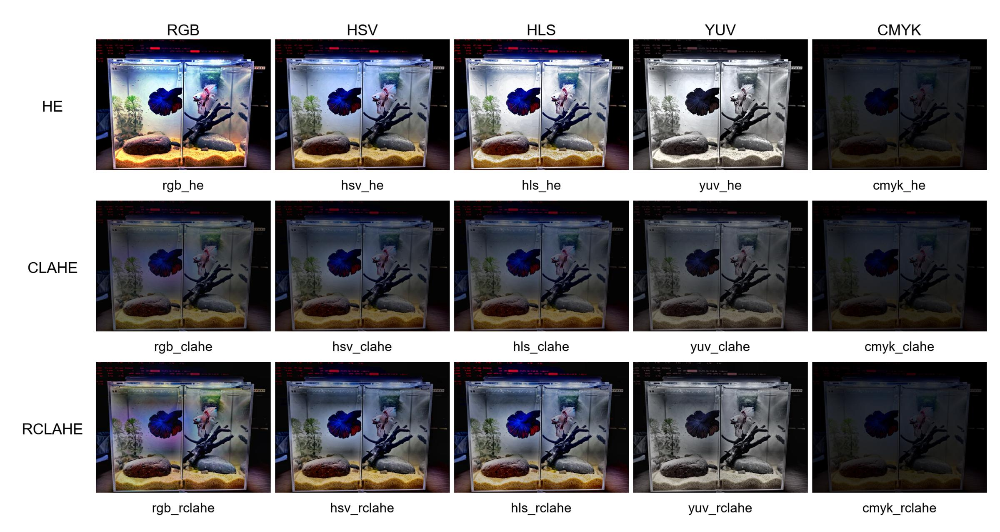
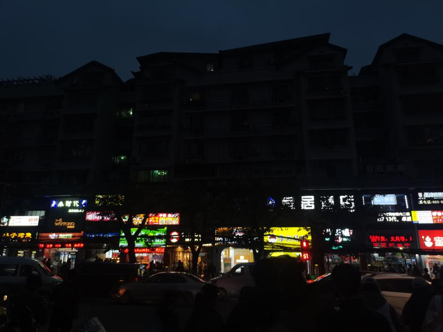
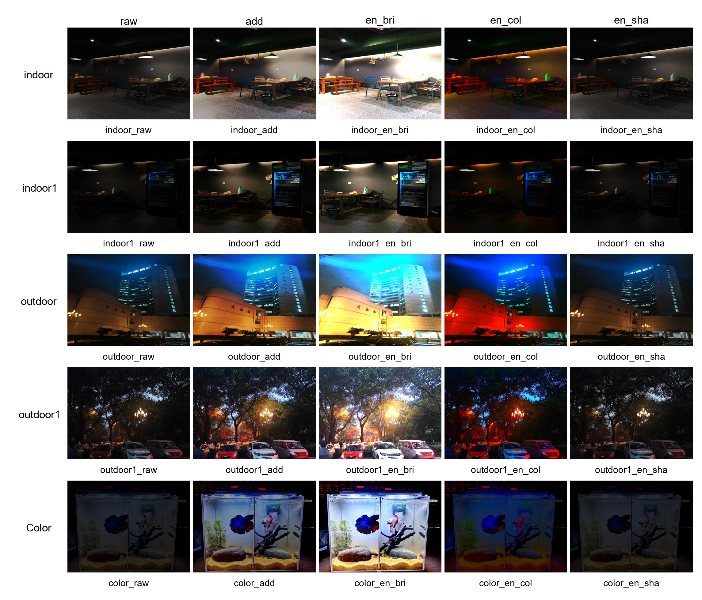

# LLIE-Lib : Low-Light Image Enhancement Library
LLIE Lib is a comprehensive, production-ready library for low-light image enhancement, featuring both traditional algorithms and state-of-the-art deep learning models. Built with modularity and performance in mind, it supports the latest PyTorch versions and offers GPU acceleration for fast processing.

**🚀 Feel free to use this library in your research!**

**⭐ Star us on GitHub — your support means a lot!**

## ✨ **Key Features**

### 📚 **Comprehensive Algorithm Collection**

- **Traditional Methods** (15+ algorithms)
  - HE Series: HE, CLAHE, RCLAHE
  - Retinex-based: MSR, MSRCR, NPE
  - Physics-based: Dark Channel Prior (DCP), LIME
  - Mathematical: Gamma correction, Log transformation
- **Deep Learning Models** ( for now )
  - Classic: Zero-DCE (CVPR 2020), SCI (CVPR 2022)

More algorithms will be released soon !

### 🛠️ **Developer Friendly**

- ✅ Unified API for all algorithms
- ✅ Extensive configuration options
- ✅ Comprehensive logging and monitoring
- ✅ Full test coverage (85%+)
- ✅ Detailed API documentation

## 📦 **Installation**

There are three ways to install `LLIELib`.

```
conda create -n LLIE-Lib python=3.11 -y
torch==2.9.0 torchvision==0.24.0 torchaudio==2.9.0
pip install -r requirements.txt
```

**Method 1: Install from Source Code**

```python
git clone https://github.com/glory-wan/LLIE-Lib.git

pip install -e .  # Recommand! Editable mode, suitable for those who wish to modify the source code.
pip install .     # Standard mode, suitable for installing the package without the need for further modification of the source code.
```

**Method 2: Install Using a Compressed Package**

With this method, you don't need to download the source code. Simply download a compressed package and execute the following command in your local Python environment.

The compressed package can be found at `LLIE-Lib/dist`, or you can download it from the `Releases` section.

```
pip install LlieLib.tar.gz
```

## 🚀 Quick Start

### 1. For image 

#### **Command Line Interface**

To quickly start processing images using the command-line interface:

```python
# traditional algorithm
python commandTA.py --img path/to/img --method he --cs hsv --name he_hsv --display True
# deep learning algorithm
python commandDL.py --model model --model_path weights.pth --input_dir path/to/img --output_dir path/to/output_img
```

### Script Interface

To use the library in a Python script:

### Parameters ( traditional algorithm )

The configuration parameters for the algorithms can be set via the command line or within a script:

- `--img`: Path to the image file (URL or local path).
- `--method`: Selected algorithm (e.g., `he`, `clahe`, `rclahe`).
- `--cs`: Selected color space (e.g., `rgb`, `hls`, `hsv`, `lab`, `yuv`).

Optional parameters include `clipLimit`, `gridSize`, `iteration`, `name`, `save`, `format`, `display`, `width`, and `height`.

More details can be found in the `LibLlie/troditionAlgorithm/config.py` file.

```python
img = script_ta(
        path_to_img,
        algorithm='DCP',
        color_space='rgb',

        # following parameters are alternative
        showimg=True,
        saveimg=False,
        # name='rgb_he',
        # width=800,
        # height=600,
        # format='jpg',
        # directory=results_path,
        # clipLimit=,   # default = 2.0
        # gridSize=,    # default = 8
        # iteration=    # default = 2
        # dcpSize=15,     # default = 15
    )
```

### Parameters ( deep learning model )

The configuration parameters for the algorithms can be set via the command line or within a script:

- `--model`: the deep learning algorithm
- `--model_path`: the weights which will be load, saved in `LibLlie/models`. If you want to use the interface in other projects, you need to **copied the weights** to your projects' directory.

Other parameters are optional.

More details can be found in the `LibLlie/deelLearning/config.py` file.

```python
img = scriptDL(
        model='Zero-DCE',
        model_path='LibLlie/models/Zero-DCE/Zero-DCE.pth',
        input=r'assets/input.jpg',
        # input=r'assets/DL_test',
        output_dir=r'results',
        # save_format='jpg',
        
        # These two parameters only work if input is a file
        save_image=False,
        show_image=True,

        # following parameters are alternative
        # save_image=False,
        # show_image=True,
        # gpu=0,
        # batch_size=1,
        # output_height=512,
    )
```

### **2. Low-light Video Enhancement** ( coming soon )

## 🎯 **Advanced Features** (coming soon)

### **1. Training & Fine-tuning**

### **2. Evaluation & Metrics**

## 📈 Case Studies

Below are some examples demonstrating the enhancement effects achieved using `LibLLIE` on low-light images.

**Original vs Enhanced Images using `HE series`**

the input

the results of HE series

**Original vs Enhanced Images using `gamma correction`**

The input

The result with varying gamma values

```python
for i in tqdm(np.arange(0.0, 30.0, 0.05)):  # Gamma values from 0.0 to 30.0 with a step size of 0.05
    gamma_img = gamma_correction(img, gamma=i)
```

https://private-user-images.githubusercontent.com/98147662/358849964-d0ce4ae0-44d3-46e4-b5d0-0fa6e3a57546.mp4?jwt=eyJhbGciOiJIUzI1NiIsInR5cCI6IkpXVCJ9.eyJpc3MiOiJnaXRodWIuY29tIiwiYXVkIjoicmF3LmdpdGh1YnVzZXJjb250ZW50LmNvbSIsImtleSI6ImtleTUiLCJleHAiOjE3MjM5MDM5OTgsIm5iZiI6MTcyMzkwMzY5OCwicGF0aCI6Ii85ODE0NzY2Mi8zNTg4NDk5NjQtZDBjZTRhZTAtNDRkMy00NmU0LWI1ZDAtMGZhNmUzYTU3NTQ2Lm1wND9YLUFtei1BbGdvcml0aG09QVdTNC1ITUFDLVNIQTI1NiZYLUFtei1DcmVkZW50aWFsPUFLSUFWQ09EWUxTQTUzUFFLNFpBJTJGMjAyNDA4MTclMkZ1cy1lYXN0LTElMkZzMyUyRmF3czRfcmVxdWVzdCZYLUFtei1EYXRlPTIwMjQwODE3VDE0MDgxOFomWC1BbXotRXhwaXJlcz0zMDAmWC1BbXotU2lnbmF0dXJlPTI3NDZhZWIzNjlmZjllYzBmMmJlNjY1NjA1M2E4MTVkODIzZDllYzU4ZmY1MTE3NGVjNGJmOGUxMWMyNTA0MjcmWC1BbXotU2lnbmVkSGVhZGVycz1ob3N0JmFjdG9yX2lkPTAma2V5X2lkPTAmcmVwb19pZD0wIn0.w5kiKEUuKRQxtrLUhfqXudHTISplUSLhk5DonfFXFtI

**Original vs Enhanced Images using `Dark Channel Prior`** 


**Original vs Enhanced Images using `Single-Frame Multi-Enhancement Fusion`**

(This part of the code will be uploaded soon)

## 🤝 **Contributor**

- [Glory wan](https://github.com/glory-wan)  Email: glory947446@gmail.com

- [Bainianzzz](https://github.com/Bainianzzz) Email: (cooming soon)

  We welcome contributions to improve this library.

## 📞Contact us

If you have any question or suggestion, please feel free to contact us by [raising an issue](https://github.com/glory-wan/LLIE-Lib/issues) or sending an email to glory947446@gmail.com.

## 📄 **License**

This project is licensed under the MIT License - see the `LICENSE` file for details.
