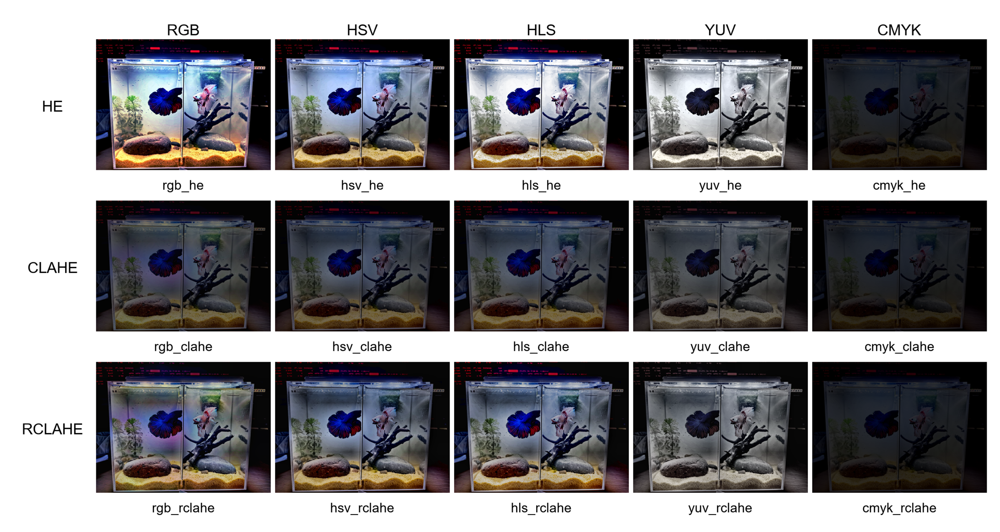
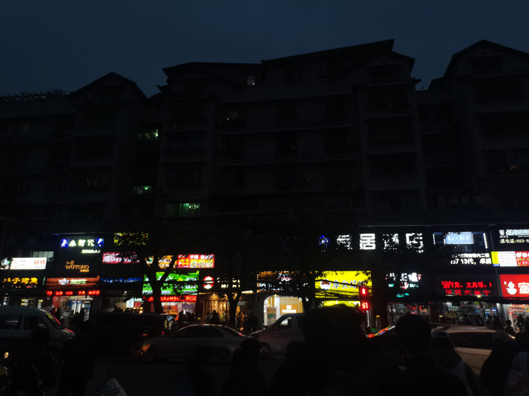
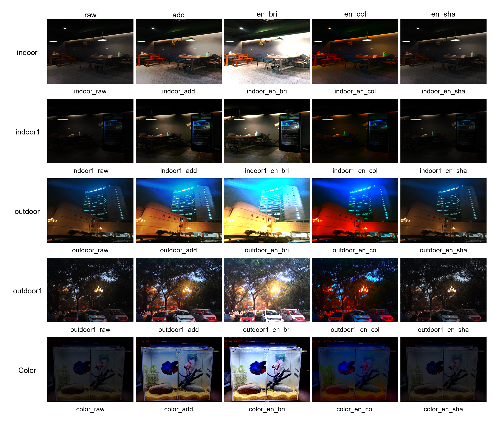

# LibLLIE: Low-Light Image Enhancement Library

`LibLLIE` is an open-source library **for Low-Light Image Enhancement** built on PyTorch.

​	This Python library provides a collection of traditional machine learning algorithms for low-light image enhancement. The library supports multiple color spaces and offers various methods for image enhancement. It is designed to be modular and easy to integrate into your existing projects.

​	The integration code for deep learning models is currently being developed and will be released soon !

​	Feel free to use this library in your research!

⭐ Star us on GitHub — your support means a lot!

## Table of Contents

- [Installation](#installation)

- [Implementations](#Demonstration)
- HE series
  
- Math series
  
- Dark Channel Prior(DCP)
  
- Multiple Color Spaces

**Supported Algorithms** for now :

HE Series: HE、CLAHE、RCLAHE

Math series: gamma correction、log transformation

Dark Channel Prior(DCP): implementation of paper : [Single image haze removal using dark channel prior](https://kaiminghe.github.io/cvpr09/index.html)

Color Spaces: RGB、HLS、HSV、LAB、YUV...

More algorithms will be released soon !

## Installation

There are two ways to install `LibLLIE`.

```python
conda create -n LlieLib python=3.8 -y
pip install -r requirements.txt
```

**Method 1: Install from Source Code**

```python
git clone https://github.com/glory-wan/LLIE-Lib.git

pip install -e .  # Editable mode, suitable for those who wish to modify the source code.
pip install .     # Standard mode, suitable for installing the package without the need for further modification of the source code.
```

**Method 2: Install Using a Compressed Package**

With this method, you don't need to download the source code. Simply download a compressed package and execute the following command in your local Python environment.

The compressed package can be found at [`LLIE-Lib/dist`](https://github.com/glory-wan/LLIE-Lib/tree/main/dist), or you can download it from the [Releases](https://github.com/glory-wan/LLIE-Lib/releases) section.

```
pip install LibLlie-1.0.tar.gz
```

## Quick Start

### Command-Line Interface

To quickly start processing images using the command-line interface:

```
python example/commandTA.py --img path/to/img --method he --cs hsv --name he_hsv --display True
```

Supported algorithms and color spaces can be found in the `LibLlie/troditionAlgorithm/config.py` file.

### Script Interface

To use the library in a Python script:

```python
from LibLlie.scriptTA import script_ta

img = script_ta(
    img_path='path/to/img.jpg',
    algorithm='he',
	
    # following parameters are alternative
    showimg=True,
    saveimg=False,
    # name='rgb_he',
    # width=800,
    # height=600,
    # format='jpg',
    # directory=results_path,
    # clipLimit=2.0,   # default = 2.0
    # gridSize=8,    # default = 8
    # iteration=2,    # default = 2
)
```

### Parameters

The configuration parameters for the algorithms can be set via the command line or within a script:

- `--img`: Path to the image file (URL or local path).
- `--method`: Selected algorithm (e.g., `he`, `clahe`, `rclahe`).
- `--cs`: Selected color space (e.g., `rgb`, `hls`, `hsv`, `lab`, `yuv`).

Optional parameters include `clipLimit`, `gridSize`, `iteration`, `name`, `save`, `format`, `display`, `width`, and `height`.

More details can be found in the `LibLlie/troditionAlgorithm/config.py` file.

## Case Studies

Below are some examples demonstrating the enhancement effects achieved using `LibLLIE` on low-light images.

**Original vs Enhanced Images using `HE series`**

the input

the results of HE series



**Original vs Enhanced Images using `gamma correction`**

The input



The result with varying gamma values

```python
for i in tqdm(np.arange(0.0, 30.0, 0.05)):  # Gamma values from 0.0 to 30.0 with a step size of 0.05
    gamma_img = gamma_correction(img, gamma=i)
```

https://private-user-images.githubusercontent.com/98147662/358849964-d0ce4ae0-44d3-46e4-b5d0-0fa6e3a57546.mp4?jwt=eyJhbGciOiJIUzI1NiIsInR5cCI6IkpXVCJ9.eyJpc3MiOiJnaXRodWIuY29tIiwiYXVkIjoicmF3LmdpdGh1YnVzZXJjb250ZW50LmNvbSIsImtleSI6ImtleTUiLCJleHAiOjE3MjM5MDM5OTgsIm5iZiI6MTcyMzkwMzY5OCwicGF0aCI6Ii85ODE0NzY2Mi8zNTg4NDk5NjQtZDBjZTRhZTAtNDRkMy00NmU0LWI1ZDAtMGZhNmUzYTU3NTQ2Lm1wND9YLUFtei1BbGdvcml0aG09QVdTNC1ITUFDLVNIQTI1NiZYLUFtei1DcmVkZW50aWFsPUFLSUFWQ09EWUxTQTUzUFFLNFpBJTJGMjAyNDA4MTclMkZ1cy1lYXN0LTElMkZzMyUyRmF3czRfcmVxdWVzdCZYLUFtei1EYXRlPTIwMjQwODE3VDE0MDgxOFomWC1BbXotRXhwaXJlcz0zMDAmWC1BbXotU2lnbmF0dXJlPTI3NDZhZWIzNjlmZjllYzBmMmJlNjY1NjA1M2E4MTVkODIzZDllYzU4ZmY1MTE3NGVjNGJmOGUxMWMyNTA0MjcmWC1BbXotU2lnbmVkSGVhZGVycz1ob3N0JmFjdG9yX2lkPTAma2V5X2lkPTAmcmVwb19pZD0wIn0.w5kiKEUuKRQxtrLUhfqXudHTISplUSLhk5DonfFXFtI

**Original vs Enhanced Images using `Dark Channel Prior`**


**Original vs Enhanced Images using `Single-Frame Multi-Enhancement Fusion`**

(This part of the code will be uploaded soon.)



## Contributor

Some parts of `LLIELib`'s code were completed with the assistance of [BZ2116](https://github.com/BZ2116), [KyleTang-0711]([KyleTang-0711 (github.com)](https://github.com/KyleTang-0711)), [Bainianzzz](https://github.com/Bainianzzz), [purpleflower](https://github.com/purpleflower), [Mystic2004](https://github.com/Mystic2004), [Humbleb11](https://github.com/Humbleb11), [7dayu6](https://github.com/7dayu6) .

​	We welcome contributions to improve this library. If you would like to contribute, please fork the repository, create a new branch, and submit a pull request.

## Contact us

If you have any question or suggestion, please feel free to contact us by [raising an issue](https://github.com/glory-wan/LLIE-Lib/issues) or sending an email to glory947446@gmail.com.

## License

`LibLLIE` is licensed under the MIT License. See the LICENSE file for more details.